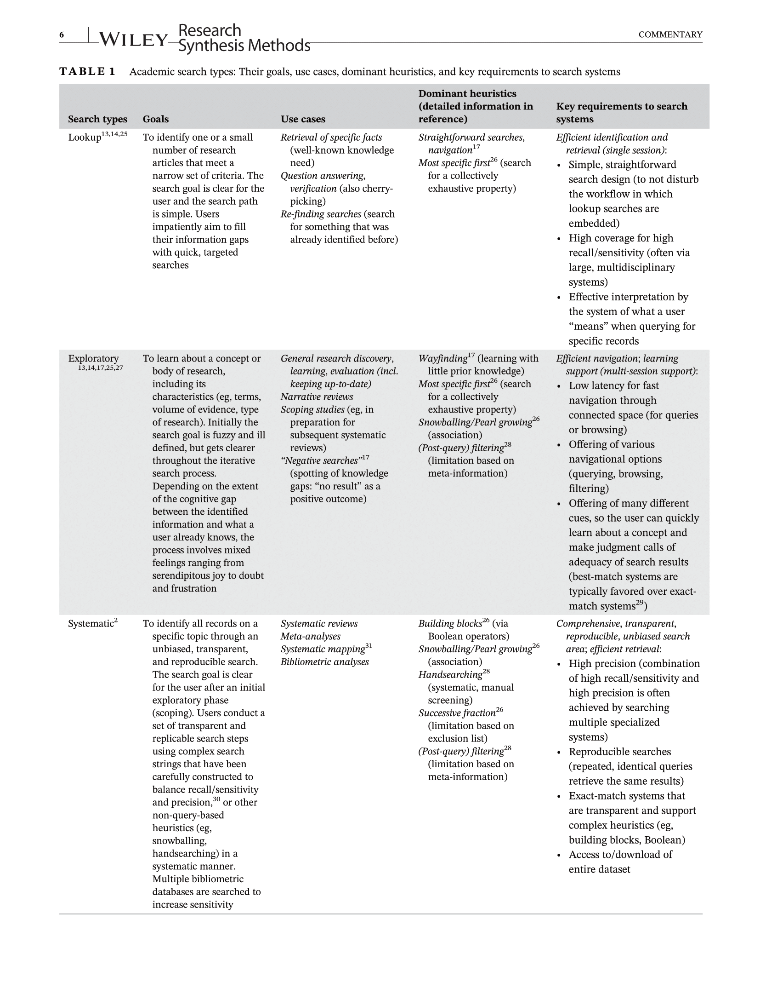

```{r setup, include=FALSE}
knitr::opts_chunk$set(echo = FALSE, cache=TRUE)
```

## What this talk will address

- Motivating problems & our bee example
- General advice on searching
- Refining search terms
    - litsearcher
- Examining and grouping search results
    - scimeetr
    - revtools
- Future directions
    - doi2txt

## Patience please :)
Liz is learning how to do these slides with R-markdown in a safe and friendly environment.
Sorry for the lack of pretty formatting, details etc.  
  
```{r fig.align="center", out.width = "90%"}
knitr::include_graphics("https://media.giphy.com/media/UxREcFThpSEqk/giphy.gif")
```

## Searching the literature: Motivating problem(s) {.columns-2}

- Complex search terms (AND, OR, NEAR…TOPICS, TITLES, TYPES… SOURCES, YEARS…)
- Unknown search terms (familiar with only part of the literature)
- Getting too much literature (and lots of junk)
- Getting not enough literature (missing many key papers)

```{r fig.align="center", out.width = "90%"}
knitr::include_graphics("https://c.pxhere.com/photos/8b/47/scrap_archive_files_briefcase_papers_old_documents_secret-1188160.jpg!d")
```

## {}

Particularly issues with broad/complex/interdisciplinary issues (like everything conservation) this can be quickly overwhelming...  
  
```{r fig.align="center", out.width = "90%"}
knitr::include_graphics("https://media.giphy.com/media/7E8lI6TkLrvvAcPXso/giphy.gif")
```

## Example of the problem
  
**AIM: summarise evidence for impacts of managed bees on native bees**

Broad, complex, interdisciplinary topic: 

- managed bees can be Apis, Bombus, ...
- native bees can also be many 
- common names ("honeybee", "pollinators", ...) 
- many direct (nesting, foraging) and indirect (plant, pests, pesticides) interactions
- overlap of literatures: entomology, plant ecology, ecosystem services,...

## Example of the problem - search terms
| Category| Term list |
|:--------|:----------|
|Managed|(African* NEAR bee) OR Apis OR Bombus OR "bumble bee" OR bumblebee* OR "honey bee" OR honeybee OR ((introduc* OR inva* OR non-native OR nonnative OR commercial OR exotic OR feral OR managed) NEAR (bee OR pollin*))| 
|Native|(((cavity OR ground) NEAR nesting) OR (native OR solitary OR wild)) NEAR (bee OR pollin*)|
|Interaction|pollinat* OR network* OR “niche overlap” OR “partitioning” OR interact* OR competit* OR facilitat* OR mutualis* OR “resource limitation” OR hybridization OR introgression OR dependence OR assemblag* OR overlap OR spillover OR impact*|

## Example of the problem - search results
| Search                               | Number of results |
|:-------------------------------------|:------------------|
|TOPIC(M AND N AND I), ALL             | 2,406 |
|TOPIC(M AND N), TITLE(I), ALL         | 1,127 |
|TITLE(M AND N AND I), ALL             |   194 |
|TOPIC(M AND N AND I), ALL, _near> and_| 3,746 |
|TOPIC(M AND N AND I), DocType = Review|   167 |
|TOPIC(M AND N AND I AND review terms) | 258 (95)|

: Searched Web of Science on 11/16/2020

## Two solutions (not mutually exclusive) {.columns-2}

```{r, out.width="80%"}
   
```
  
Improve/narrow search terms further  

<br>

```{r, out.width="80%"}
   
```
  
Characterise the literature first, then select groups to include

## Improving/narrowing search terms: {.smaller}

More specificity 

- include NEAR/x, NOT, SAME
- restrict research areas / journals
- see e.g.: 
    - [WoS Advanced search](https://images.webofknowledge.com/WOKRS535R100/help/WOS/hp_advanced_search.html)
    - [WoS Boolean terms](https://images.webofknowledge.com/images/help/WOS/hs_search_operators.html)

Arbitrary cut-offs

- years, language, document types
- select top-n by times cited, relevance (Title, Abstract, Keywords, Keywords Plus)

<span style="color:red; font-weight: bold">
Emerging approaches

- <span style="color:red">semi-automated extraction of search terms
- <span style="color:red">word groups (N-grams, or word co-occurences in ordered sets)
</span>

## General advice for searching #1

- New paper by Gusenbauer & Haddaway ([DOI: 10.1002/jrsm.1457](https://doi.org/10.1002/jrsm.1457)) which outlines general advice for searching
- "Google Scholar...shows us beautifully how a
system can be perfectly suited for one type of search, while
failing miserably for another."
    - "targeted searches" = good 
    - "systematic searches" = rubbish!

```{r, out.width = "100%", echo=FALSE}



```

## General advice for searching #2

- Write a protocol to avoid mission-creep
- Use multiple databases (include Google Scholar, WoS, dogpile, pubmed, etc.)
- Use topic searches in WoS  
- [KeyWords Plus](https://support.clarivate.com/ScientificandAcademicResearch/s/article/KeyWords-Plus-generation-creation-and-changes?language=en_US): important words extracted from the _title of references cited_ (WoS only). Included in TOPIC search (along with title and author-supplied keywords). 

- But be aware of biases at all times (Bas et al. 2020 Journal of Clinical Epidemiology,121,
https://doi.org/10.1016/j.jclinepi.2020.01.009.)
  *"Literature searches based on title, abstract, and keywords alone may not be sufficiently sensitive for studies of epidemiological research practice."*


## Improving search terms: litsearchr  {.columns-2}
```{r, out.width=450}
   knitr::include_graphics('https://elizagrames.github.io/litsearchr/styles/litsearchr-hex.png')
```

- partially automates keyword selection and writing Boolean search strings
- uses the Rapid Automatic Keyword Extraction algorithm to identify potential keywords from a scoping search 
- selects important keywords based on their importance in a keyword co-occurrence network
- after keywords are grouped into concept groups, litsearchr writes Boolean searches

## litsearchr example 1.1: Load example literature

Based on 16 articles suggested by our co-authors (import, and resolve duplicates)

```{r litsearchr example, echo=TRUE, message=FALSE, warning=FALSE}

library(litsearchr)
library(synthesisr)
library(tidyverse)

file_names <- "data/suggested.bib"
data <- synthesisr::read_refs(file_names)

cleaned_data <- synthesisr::deduplicate(data,
                                        match_by = "title",
                                        method = "string_osa",
                                        rm_punctuation = TRUE,
                                        to_lower = TRUE)
```

Table: Titles in the sample database (n=`r nrow(cleaned_data)`)
```{r echo=FALSE}

knitr::kable(cleaned_data %>% 
  select(year, title) %>% 
  head(5))
  
```

## litsearchr example 1.2: Find co-occuring keywords

We can extract and clean tagged keywords (author or database supplied)

```{r echo=TRUE}
tag_keywords <- litsearchr::extract_terms(keywords = paste(
                                             cleaned_data$keywords, 
                                             cleaned_data$keywords),
                                           method = "tagged",
                                           min_freq = 2,
                                       stopwords ="English")
```

```{r}
# for presentation of some tagged words
tag_keywords %>% 
  sample(10) %>% 
  str_remove_all('english') %>% 
  str_trim() %>% 
  str_squish() 
```

Or, using the Rapid Automatic Keyword Extraction ("rake") algorithm we find co-occurring keywords (n-grams) from the titles and abstracts  

```{r echo=TRUE}
rake_keywords <- litsearchr::extract_terms(text = paste(
                                             cleaned_data$title, 
                                             cleaned_data$abstract),
                                           method = "fakerake",
                                           min_freq = 2,
                                           stopwords ="English")

```

```{r, echo=FALSE, attr.output='style="max-height: 100px;"'}
# for presentation of some raked words
rake_keywords %>% 
  sample(10) %>% 
  str_remove_all('english') %>% 
  str_trim() %>% 
  str_squish()
```


## litsearchr example 1.3: Reduce keywords
Then we can create a co-occurence network to reduce the keywords to a smaller set  
(for code, see the slide github repository linked on the title page)

```{r echo=FALSE}
naive_dfm <- litsearchr::create_dfm(
  elements = paste(cleaned_data$title, cleaned_data$abstract, cleaned_data$keywords),
  features = c(tag_keywords, rake_keywords))

naive_graph <- litsearchr::create_network(
  search_dfm = as.matrix(naive_dfm),
  min_studies = 1,
  min_occ = 1)

spline_cutoff <- litsearchr::find_cutoff(naive_graph,
                                         method = "cumulative",
                                         percent = 0.5)             ## reduce percent to reduce number of words

reduced_graph <- litsearchr::reduce_graph(naive_graph,
                                          cutoff_strength = spline_cutoff)

search_terms <- litsearchr::get_keywords(reduced_graph)
```

```{r keyword graph, out.width = "100%"}
plot(reduced_graph)
```

## litsearchr example 1.4: Group and write boolean string

Finally, we can group terms together and write a Boolean search:

```{r group and output, include = FALSE}
search_groups <- split(search_terms,
                       factor(
                         2 - as.numeric(grepl("rates|impact|competition|interactions|resources", search_terms)),
                         levels = seq_len(2),
                         labels = c("interactions", "other")))
 
bee_search <- litsearchr::write_search(search_groups,
                                              languages = "English",
                                              stemming = TRUE,
                                              closure = "left",
                                              exactphrase = TRUE,
                                              writesearch = FALSE,
                                              verbose = TRUE)
```

```{r bee boolean}
cat(str_wrap(bee_search))
```
  
WoS Search of this in TOPIC = 13,155  
Removing ("climat* chang* " OR "ecosystem* servic* " OR "function* trait*") = 1,095

Example on woodpeckers exactly as in the litsearchr vignette (see R/litsearchrVignette) starts with 156 papers, and finds 103.   

## Summary on semi-automated search term extraction (e.g. litsearcher)
Benefits: 

- identifying useful co-occurence terms 
- identifying common tagged keywords

Caveats:

- needs good sample literature to develop matrix
- can output 'common' words that should not be included 
- restrictive options can result in fewer papers than input

<span style="color:red; font-weight: bold">
Summary: Useful as a component of developing a search, when you already have a reasonable sample database, but needs human oversight.
</span>

## Approach #2: Grouping the literature, then narrow down {.columns-2}

- Concept: to utilize (full) citation records to cluster the literature
- 'Clustering' can utilize data from keywords, cited references, journals, and/or terms extracted from titles and abstracts, ...
- Characterise the clusters by tags, keywords, "topic models"
- Develop "reading lists" of key papers within clusters
- R options include: scimeetr, revtools, bibliometrix

<br>

```{r, out.width="70%", fig.align='center'}
   knitr::include_graphics('https://www.maximerivest.com/img/all_com.jpg')
```

```{r, out.width="30%"}
   knitr::include_graphics('https://revtools.net/assets/img/revtools_hex.png')
   knitr::include_graphics('https://www.bibliometrix.org/assets/images/logo-bibliometrix-piccolissimo-trasparente-110x128.png')
```

## scimeetr {.columns-2}

Designed to "help explore the literature" by

- characterising literature communities by keywords (title, abstract, keywords, keywords+, and cited references)
- return tags, top keywords, authors, cited literature
- generate reading lists by ranking, OR bibiography network characteristics

Clustering based on

- data: cited references, keywords, title, abstract (some cleaning using `tm`)
- algorithm: `igraph::cluster_louvain()` or `igraph::cluster_fast_greedy()` (self-stopping)

## scimeetr example - load data

Load as tab delimited files - note text cleaning is done automatically with no options documented, but code available to examine/modify
```{r echo=TRUE, warning=FALSE, message=FALSE}

# install.packages
# if (!require("devtools")) install.packages("devtools")
# devtools::install_github("MaximeRivest/scimeetr")

library(tidyverse) # programming
library(scimeetr) # bibiometric analysis and determination of sub-communities

dd <- "./data/raw_WoS_20201105/as_txt/"
scimeetr_list <- import_wos_files(dd)
```

## scimeetr example - the scimeetr object {.smaller}
The scimeetr object includes the biblio-data, and some summaries (tags, keywords, top authors)

```{r echo=TRUE, attr.output='style="max-height: 100px;"'}
names(scimeetr_list$com1)
scimeetr_list
```

## {.smaller}
Summary can give a little more overview
```{r echo=TRUE, attr.output='style="max-height: 100px;"'}
summary(scimeetr_list)
```

## scimeetr example - define sub-communities

- Here coupling bibliography, keywords (recommends also including title, and journal information = 'bickecticjoc')(I think these can be weighted)
- This can be done heirarchically/iteratively (`scimap(scisub, coupling_by = 'bickec')`)  
- Default is community_algorithm = 'louvain', min_com_size = 30  

```{r echo=TRUE, warning=FALSE, message=FALSE, out.width = "100%"}
scisub <- scimap(scimeetr_list, coupling_by = 'bickec')
plot(summary(scisub, com_size = 30))
```

## {.smaller}
```{r echo=TRUE, attr.output='style="max-height: 100px;"'}
summary(scisub)
```

## scimeetr example - reading lists {.smaller}
We can also characterise a corpus by extracting the top ranked papers (a 'reading list'). Several sets of options are available:

- **core_papers:** rank (cited references) by most cited 
- **core_yr:** most (cited references) by cited per year (from yrs -3 to -10)
- **core_residual:** rank by largest divergence from expected (based on fitted trend by age)
- **by_expert_LC:** returns m papers by k highest ranked (local harmonised H-index) authors
- **by_expert_TC:** returns m papers by k highest ranked (total harmonised H-index) authors
- **group_of_experts_TC:** returns m papers by k highest ranked (local harmonised H-index) author groups
- **group_of_experts_LC:** returns m papers by k highest ranked (total harmonised H-index) author groups
- **cite_most_others:** ranked by citations (review and well researched)
- **betweeness:** interdisciplinary
- **closeness:** large and wide list of citations
- **connectness:** tend to have cited what most other studies cited.

## {.smaller}
(note, code to link back to full title and doi is in the slide github repository)
```{r echo=TRUE}
dive_to(scisub, aim_at = "com1_1") %>% scilist(reading_list = "core_residual") 

dive_to(scisub, aim_at = "com1_1") %>% scilist(reading_list = "cite_most_others")
```

## scimeetr example - futher functions {.columns-2}
See the github repository for [scimeetr](https://github.com/MaximeRivest/scimeetr) or [these slides](https://github.com/lizlaw/LitDeepDiving) for more scimeetr functionality examples, customized functions and cautions  
  
Data (bib and txt bibliographies from WoS) for these slides in [OSF folder](https://doi.org/10.17605/OSF.IO/3SDWC)  

<br>

```{r out.width="50%"}
knitr::include_graphics("https://media.giphy.com/media/VcizxCUIgaKpa/giphy.gif")

knitr::include_graphics("https://media.giphy.com/media/atcqQ5PuX41J6/giphy.gif")
```

## revtools {.smaller .columns-2}
Support researchers working on evidence synthesis projects

- visualise patterns in bibliographic data
- interactively select or exclude individual articles based on
    - duplication (fuzzy match)
    - titles
    - abstracts
    - topic models
- topic models
    - data: user selected columns, concatenated into a single string & cleaned
    - algorithm:  Latent Dirichlet Allocation, LDA (or Correlated Topic Models, CTM)(needs input #of topics)

<br>

```{r, out.width="90%"}
   knitr::include_graphics('https://revtools.net/assets/img/revtools_hex.png')
```

## revtools example - load data

```{r echo=TRUE}
library(revtools)
library(tidyverse)

file_names <- list.files("./data/raw_WoS_20201105/as_bib/", full = TRUE)
data <- revtools::read_bibliography(file_names)

```

## revtools example - deduplicate & screen titles/abstracts
`find_duplicates` searches for 

    - doi (exact match)
    - title (fuzzy matching using the ‘stringdist’ package)
    
Recommended to use `screen_duplicates` (to have user oversight, esp with fuzzymatching)
Similarly, revtools facilitates manual screening of titles and abstracts (sampling here just to demo)

- (done external to this presentation - R/revtoolsShinyExample.R - because I can't work out a good way to do it here)

```{r echo = TRUE}
# data_unique <- screen_duplicates(data)

# data_ti_screened <- screen_titles(data_unique %>% sample_n(10))

# data_ab_screened <- screen_abstracts(data_ti_screened %>% sample_n(5))
```

## revtools example - topic models
- Revtools uses topic models to help with screening.
- Here we will do this with a random 100 samples from our original data.
- User chooses the columns.
- These are then:
    - collapsed to a single string
    - cleaned for punctuation, numbers, stopwords
    - fed into a (LDA) topic model
- Data points can be selected or excluded individually, or by topic.

```{r echo = TRUE}
# data_topic_screened <- screen_topics(data_unique %>% sample_n(100))
```

## revtools example - extracting the topic models {.smaller .columns-2}
What if we are interested in using the topic models for other purposes??

Revtools `screen_topics` uses:

- `make_dtm()` extracts & cleans data, runs `tm::DocumentTermMatrix()` 
- `run_topic_model()` wrapper for `topicmodels::LDA` or `topicmodels::CTM`
- `topicmodels::topics()` pulls out allocated topics perID
  
See vignettes for `topicmodels` and `tm` for more details
Or [Tidy Text Mining](https://www.tidytextmining.com/index.html) 

```{r}
dfc <- data %>% 
  sample_n(100) %>% 
  select(title, abstract, keywords)

dtm <- make_dtm(dfc)
tmm <- run_topic_model(dtm)

topic_allocated <- topicmodels::topics(tmm)
```

<br> <br> <br> <br> <br> <br> <br> <br>

```{r, out.width="80%"}
knitr::include_graphics("https://www.tidytextmining.com/images/cover.png")
```

## bibliometrix {.smaller}

Similarly to scimeetr/revtools

- provides an easy way to characterise the data
- e.g. plots by year

Differently to scimeetr/revtools

- More network plot options (plot co-author, country networks) if that's your jazz
- Fewer integrated grouping options
- History of the literature plots

Clustering based on:

- keywords, title, OR abstract (with optional 'stemming')
- Multiple Correspondence Analysis (default), or CA, MDS
- then k-means clustering on this (k = "auto" or user-supplied)

## Summary on grouping literature (scimeetr, revtools, bibliometrix) {.smaller}

Benefits:

- Groups that can be used to:
    - explore large datasets
    - alternative method to narrow down searches

Caveats: 

- emerging methods may need further development
     - data and algorithms may need 'tuning' for purpose
     - and further 'cleaning' and customising:
         - Year is missing for many interesting early access articles
         - 'stemming' of keywords (e.g. missing in scimeetr)
         - consider 'synonyms' and n-grams (e.g. missing in scimeetr)
     

<span style="color:red; font-weight: bold">
Summary: Useful to get an overview, particularly when you are just starting out, or topic is multi-faceted, but needs attention to detail.
</span>

## Diving deeper {.smaller .columns-2}

```{r out.width="90%"}
knitr::include_graphics("https://github.com/elizagrames/doi2txt/raw/main/man/figures/logo.png")
```

doi2text

- automates finding of full text from doi
- identifies and extracts sections (e.g. intro, methods, ...)

Allows text mining of (primary) literature for use 

- in literature searches
- systematic mapping, e.g. studies with particular methods

e.g. search methods/results for particular
  - species / species types 
  - landscapes / locations
  - sampling methods (pan, malaise, netting, etc)
  
## doi2txt example - retriving full text sections

Using one community drawn from the scimeetr data we developed previously (with 2nd round of community mapping)
```{r doi2txt example1, include = FALSE}

library(tidyverse)
library(scimeetr)
library(doi2txt)

# load the scimeetr data, and drill down further
scisub2 <- scimap(scisub, coupling_by = 'bickec')

```

```{r doi2txt example2, echo=TRUE}
sci112 <- dive_to(scisub2, aim_at = "com1_1_2")
sci112
```

## {}
screen for language type and document type, has doi, extract the doi, and take first 10 as an example
```{r doi2txt example3, echo=TRUE, message=FALSE, warning=FALSE}
doidf <- sci112[[1]]$dfsci %>% 
  select(DI) %>% 
  filter(DI != "") %>% 
  as_tibble() %>% 
  .[1:10,]      

doidf <- doidf %>% 
  mutate(article = map(DI, 
                       function(x) try(doi2html(x)))) %>% 
  mutate(abstract = map(article, 
                       function(x) try(extract_section(x, 
                                                        section = "abstract", 
                                                        max_lines = 1, 
                                                        clean=TRUE, 
                                                        min_words = 50, 
                                                        forcestart = TRUE)))) %>% 
  mutate(methods = map(article, 
                       function(x)  try(extract_section(x, 
                                                        section = "methods", 
                                                        max_lines = 50, 
                                                        clean=TRUE, 
                                                        min_words = 50, 
                                                        forcestart = FALSE))))

```

## {}

```{r echo=TRUE}
doidf 
```

Each paragraph is extracted to a list entry
```{r echo=TRUE}
doidf$methods[[3]][1:2]
```

## text mining example - tagging methods {.smaller}

Obviously these need to be improved...

```{r echo=TRUE}

lookfor <- function(x, find){grepl(find, str_c(x, collapse = TRUE))}

results <- doidf[c(3,4,5,6,8,9), ] %>% 
  mutate(crosspoll = map_lgl(methods, lookfor, find = 'cross-pollination')) %>% 
  mutate(selfpoll = map_lgl(methods, lookfor, find = 'self-pollination')) %>%  
  mutate(pantrap = map_lgl(methods, lookfor, find = 'pan trap')) %>% 
  mutate(floralvisits = map_lgl(methods, lookfor, find = 'visit')) %>% 
  mutate(pollen = map_lgl(methods, lookfor, find = 'pollen')) %>% 
  mutate(fruit = map_lgl(methods, lookfor, find = 'fruit')) %>% 
  mutate(useR = map_lgl(methods, lookfor, find = 'R Core Team'))

results
```

## Diving deeper - challenges & future directions

Probably very useful, but a lot of development to go:

  - best if fed in 'lists' of terms to search for
  - but this useful for standardisation of the literature
  - we can potentially automate creation of these lists via text mining  
  - but obviously better with expert oversight
  <br>    
  - Non-standard formats (titles, breaks need to be identified)
  - (Possibly) searching for data in figures and tables through their legends
  - doi2pdf2txt ??
  
## Summary {.smaller}
**Literature searches are extremely subjective - there is no way about this.**

 - what words/terms to include
 - how to combine
 - which fields to search
 - how to narrow down to a manageable set
 
**Semi-automated methods apply algorithms to make at least part of the process transparent and repeatable... BUT needs human oversight, particularly for broad, complex, interdisciplinary topics.**

- allows use of more than just title/abstract/keywords
- still requires (many more) subjective decisions
- attention to:
   - quality data in ~ checks of algorithm outputs ~ reasonable data out
   - stopwords, stemming, N-grams (learn from text mining and topic modelling)
   - algorithms for generating 'topics' and clustering them (e.g. [examples in text mining](https://doi.org/10.2196/jmir.6045) )

**Methods constantly improving, and we can improve the data going in through standardisation, term lists, etc...**


